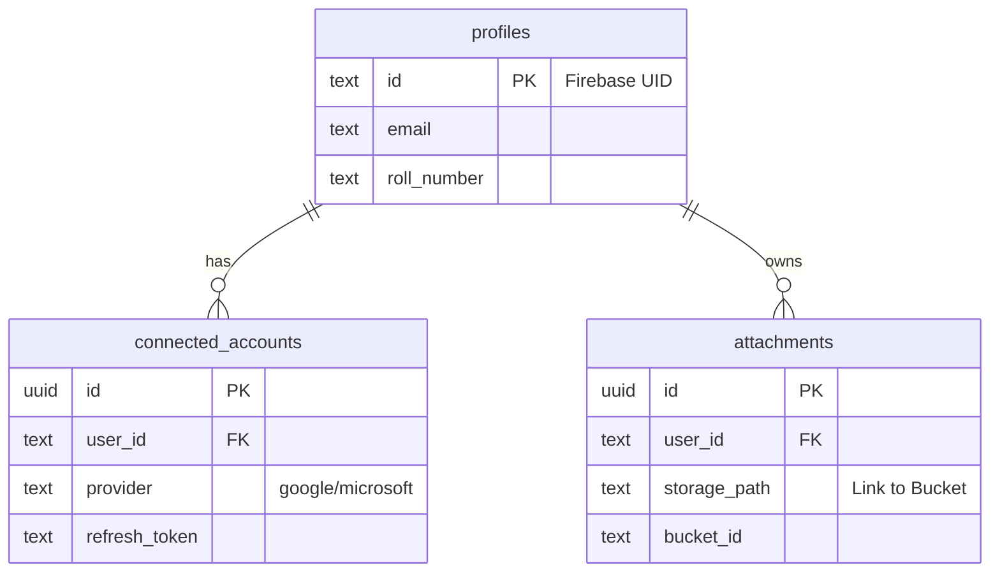

# UniSync Database Documentation

This document explicitly defines the database schema and storage architecture for the UniSync application.

## Architecture Overview

The system uses a **Hybrid Storage Model**:
1.  **Structured Data** (Metadata, User Info, Tokens) is stored in **Supabase/PostgreSQL**.
2.  **Unstructured Data** (Files, PDFs, Images) is stored in **Supabase Storage Buckets**.

---

## Storage Buckets

### `unisync-files`
This is a **Private** Supabase Storage bucket.
*   **Purpose**: Stores the actual binary content of uploaded files (assignments, documents).
*   **Structure**: `/{user_id}/{filename}`
*   **Security**: Files are private by default. Access requires a signed URL.
*   **Linkage**: The file path is stored in the `attachments` table (column: `storage_path`).

---

## Database Schema

### 1. `profiles`
**Purpose**: Stores the core identity of the student.
*   **Source**: Populated via Firebase Auth (Google/Microsoft login).

| Column | Type | Default | Description |
| :--- | :--- | :--- | :--- |
| `id` | `text` | **PK** | The **Firebase UID** of the user. |
| `email` | `text` | - | Student's KRMU email address. |
| `full_name` | `text` | - | Student's display name. |
| `roll_number` | `text` | - | Parsed from the email (e.g., `240173...`). |
| `university_domain`| `text` | - | Domain validation (e.g., `krmu.edu.in`). |
| `created_at` | `timestamp`| `now()` | Record creation time. |

### 2. `connected_accounts`
**Purpose**: Stores OAuth access and refresh tokens for external providers (Google/Outlook) to allow the AI to read emails/calendars offline.
*   **Relationship**: Belongs to a `profile` (`user_id` → `profiles.id`).

| Column | Type | Description |
| :--- | :--- | :--- |
| `id` | `uuid` | Unique ID for this connection. |
| `user_id` | `text` | **FK** to `profiles.id`. |
| `provider` | `text` | The service provider (`google` or `microsoft`). |
| `email_address` | `text` | The email address associated with the provider. |
| `access_token` | `text` | Short-lived token for API access. |
| `refresh_token` | `text` | Long-lived token to generate new access tokens. |
| `expires_at` | `bigint`| Unix timestamp when the token expires. |

### 3. `attachments`
**Purpose**: Acts as the metadata registry for files stored in the Storage Bucket.
*   **Relationship**: Belongs to a `profile` (`user_id` → `profiles.id`).

| Column | Type | Description |
| :--- | :--- | :--- |
| `id` | `uuid` | Unique ID for the attachment record. |
| `user_id` | `text` | **FK** to `profiles.id` (Owner of the file). |
| `file_name` | `text` | Original name of the uploaded file. |
| `file_type` | `text` | Extension (e.g., `pdf`, `jpg`). |
| `storage_path` | `text` | **CRITICAL**: The path in the bucket (e.g., `uid/file.pdf`). |
| `bucket_id` | `text` | The bucket name (`unisync-files`). |
| `created_at` | `timestamp`| Upload timestamp. |

---

## Entity Relationship Diagram

